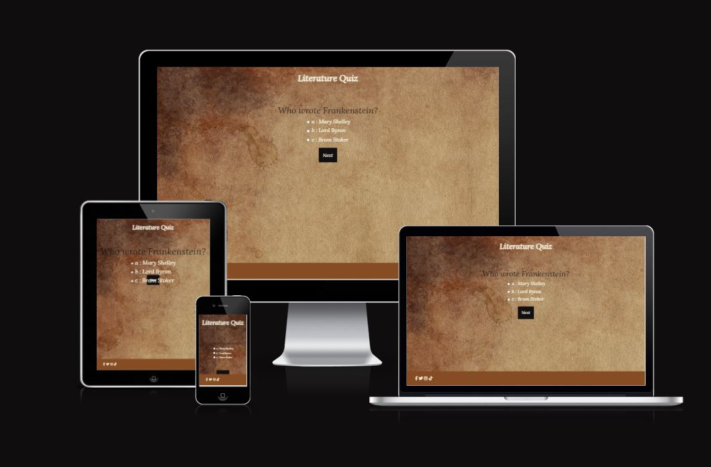
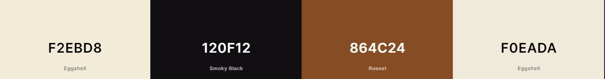
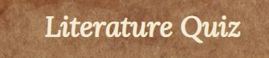
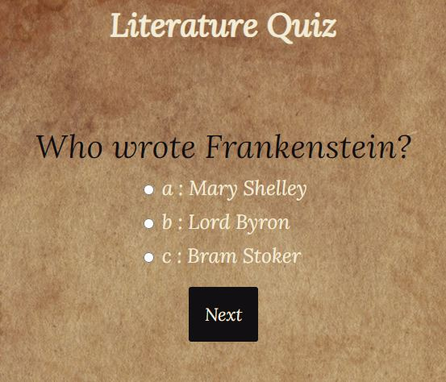
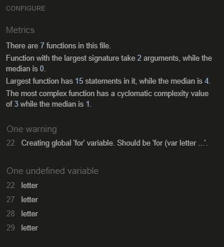
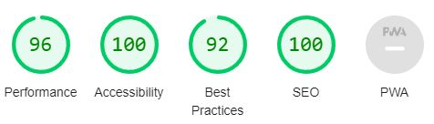

# Literature Quiz

The Literature Quiz is there to test your knowledge on a few simple literature questions.

It involves programming languages like HTML5 CSS3 and JavaScript.

Visit the deployed website [here](https://sam00edwards.github.io/quiz/index.html).

## Table of Contents

1. [User Experience (UX)](#user-experience-ux)
    1. [Project Goals](#project-goals)
    2. [Colour Scheme](#colour-scheme)
    3. [Typography](#typography)
2. [Features](#features)
    1. [Main](#main)
    2. [Landing Page](#landing-page)
 3. [Technologies Used](#technologies-used)
    1. [Languages Used](#languages-used)
    2. [Frameworks, Libraries and Programs Used](#frameworks-libraries-and-programs-used)
4. [Testing](#testing)
    1. [Code Validation](#code-validation)
    2. [Accessibility](#accessibility)
    3. [Tools Testing](#tools-testing)
    4. [Manual Testing](#manual-testing)
5. [Deployment](#deployment)
    1. [GitHub Pages](#github-pages)
6. [Credits](#credits)
    1. [Content](#content)
    2. [Media](#media)
    3. [Code](#code)
    4. [ReadME](#readme)

***

## User Experience (UX)

### Project Goals

The main goal of this project is to showcase and test the users knowledge on a few simple questions about classic literature and their authors.

### Colour Scheme

The colours used in this website are mainly cream, black and brown with the main background being an image of parchment to fit the theme.

Many online images and colour scheme references were examined both through google images and pinterest.

### Typography

The site primarily uses 'Lora' as the font of choice with 'Serif' as the back-up option if that doesn't work properly. This font was chosen again because it feels a little vintage and old world and would match the theme of the website. 

[Back to top ⇧](#literature-quiz)

## Features

### Main

* **Page Title**

    
    - The title describes the name of the quiz which in turn also allows you to gather the theme of the website.

    - When the title is clicked it will take you back to the landing page.

* **Footer**

    - The footer includes the quiz' social media links.

### Landing Page

* **Landing Page**

    - The landing page is designed to represent the aesthetic and general mood the website is trying to emulate.

[Back to top ⇧](#literature-quiz)

## Technologies Used

### Languages Used
* [HTML5](https://en.wikipedia.org/wiki/HTML5)
* [CSS3](https://en.wikipedia.org/wiki/CSS)
* [JavaScript](https://en.wikipedia.org/wiki/JavaScript)

### Frameworks, Libraries and Programs Used

* [Google Fonts](https://fonts.google.com/)
    - Access was granted to the various fonts through use of Google Fonts.

* [Font Awesome](https://fontawesome.com/)
     - Font Awesome was used to add the social media icons.

* [GitPod](https://gitpod.io/)
     - GitPod was used for writing code, committing, and then pushing to GitHub.

* [GitHub](https://github.com/)
     - GitHub was used to store the project after pushing.

* [Am I Responsive?](http://ami.responsivedesign.is/#)
    - Am I Responsive was used in order to see responsive design throughout the process and to generate mockup imagery to be used.

* [Chrome DevTools](https://developer.chrome.com/docs/devtools/)
    - Chrome DevTools was used during the development process for code review and to test responsiveness.

* [W3C Markup Validator](https://validator.w3.org/)
    - W3C Markup Validator was used to validate the HTML code.

* [W3C CSS Validator](https://jigsaw.w3.org/css-validator/)
    - W3C CSS Validator was used to validate the CSS code.

* [JSHint](https://jshint.com/)
    - JS Hint was used to validate the JavaScript code.

[Back to top ⇧](#literature-quiz)

## Testing

### Code Validation

* The [W3C Markup Validator](https://validator.w3.org/), [W3C CSS Validator](https://jigsaw.w3.org/css-validator/) and [JSHint](https://jshint.com/) were used to make sure there were no errors or bugs in the system.

    - W3C Markup Validator found no errors or warnings on my HTML. 
    - W3C CSS Validator found no errors or warnings on my CSS.
    - JS Hint showed me a warning for my 'for' loop on line 22.
    
    
    - This was easily rectified by adding a 'var' inside the brackets.

### Accessibility

* Used Lighthouse in Chrome DevTools to confirm that it met the necessary accessibility scores.

* Lighthouse reports

    - **Landing Page**

    

### Tools Testing

* [Chrome DevTools](https://developer.chrome.com/docs/devtools/)

    - Chrome DevTools was heavily used to test and modify elements in real time before they were entered or copy pasted into gitpod.

* Responsiveness
    
    - [Am I Responsive?](http://ami.responsivedesign.is/#) was used to check responsiveness of the site pages across different devices.
    
    - Chrome DevTools was used to test responsiveness in different screen sizes during the development process.

### Manual Testing

* Browser Compatibility

    - The website has been tested on the following browsers:

        - **Google Chrome**
        
        No appearance, responsiveness nor functionality issues.

        - **Opera**
        
        No appearance, responsiveness nor functionality issues.

        - **Microsoft Edge**
        
        No appearance, responsiveness nor functionality issues.

* Device compatibility

    - The website has been tested on multiple devices, including:

        - **Windows 10 Desktop**

        No appearance, responsiveness nor functionality issues.

* Common Elements Testing

        
        - **Header**

            - Clicking on the title text will bring the customer back to the landing page.

        - **Next and Submit Buttons**

            - Hovering on the buttons will trigger the hover effect, slightly changing the colour of the button.
        
        - **Footer**
        
            - Clicking on the social media links will open the specific website in a new tab.

[Back to top ⇧](#literature-quiz)

## Deployment

* This website was developed using [GitPod](https://www.gitpod.io/), which was then committed and pushed to GitHub using the GitPod terminal.

### GitHub Pages

* Here are the steps to deploy this website to GitHub Pages from its GitHub repository:

    1. Log in to GitHub and locate the [GitHub Repository](https://github.com/).

    2. On the left hand side is a menu, click on 'Pages' underneath 'Code and automation'.

    3. Choose 'Deploy from a branch' under 'source'.

    4. Choose 'main' under 'source'.

    5. Save.

    6. Refresh and your website link should be available

[Back to top ⇧](#literature-quiz)

## Credits 

### Content

* [Footer](https://sam00edwards.github.io/book-nook/index.html)

    - Footer Code sourced from my first project The Book Nook.

* [Questions](https://brokebybooks.com/an-epic-list-of-50-literature-trivia-quiz-questions/)

    - Some questions were lifted from this quiz website.

* [Code](https://www.sitepoint.com/simple-javascript-quiz/)

    - HTML, CSS and JavaScript code was referenced from this website.

### Media

* [Pexels](https://www.pexels.com/)

    - [Background Image](https://www.pexels.com/photo/empty-brown-canvas-235985/)
    Image of parchment.

### Code

* [Stack Overflow](https://stackoverflow.com/), [W3Schools](https://www.w3schools.com/) and [sitepoint](https://www.sitepoint.com/simple-javascript-quiz/) were consulted on a regular basis for inspiration and sometimes to be able to better understand the code being implemented.
* Previously submitted projects were also heavily consulted on a regular basis to understand how the code worked.
    - [dhakal79 - Quiz on Coagulation in Water Treatment](https://github.com/dhakal79/Portfolio-project-MS2#table-of-contents)
    - [jas-sin82 - Planet IQ Quiz App](https://github.com/jas-sin82/milestone-project-2#features)
    - [iKelvvv - Rock, Paper, Scissors, Lizard, Spock Olympic Games Edition](https://github.com/iKelvvv/MS2)
    - [Sam00Edwards - The Book Nook](https://github.com/Sam00Edwards/book-nook)

### ReadME

* The outline of this ReadME was based on various examples provided to me by my mentor, Marcel, and my own previous ReadME for the first project. All of the images have been changed and any text that remains identical is text where only a simple explanation is warranted and to change it would be unnecessary.
    - [dhakal79 - Quiz on Coagulation in Water Treatment](https://github.com/dhakal79/Portfolio-project-MS2#table-of-contents)
    - [jas-sin82 - Planet IQ Quiz App](https://github.com/jas-sin82/milestone-project-2#features)
    - [iKelvvv - Rock, Paper, Scissors, Lizard, Spock Olympic Games Edition](https://github.com/iKelvvv/MS2)
    - [Sam00Edwards - The Book Nook](https://github.com/Sam00Edwards/book-nook)

[Back to top ⇧](#literature-quiz)